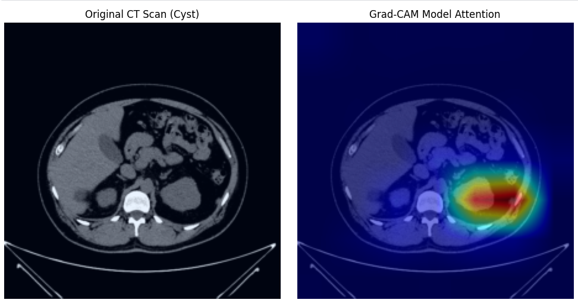
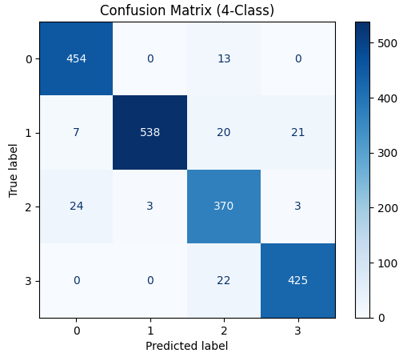

## Demo

<p align="center">
  
</p>

# Kidney CT Scan Classification using Deep Learning

A deep learning project for classifying kidney CT scan images into four diagnostic categories:

* **Normal**
* **Cyst**
* **Tumor**
* **Stone**

The model was developed using PyTorch and Transfer Learning with ResNet50, achieving strong classification performance while incorporating Grad-CAM visualizations for explainability.

---

## Project Overview

Medical image classification can assist healthcare professionals by automatically identifying abnormalities in CT scans.

This project focuses on multi-class kidney CT scan classification using a pre-trained ResNet50 model fine-tuned on kidney CT images collected from publicly available datasets.

---

## Features

* Transfer Learning using ResNet50
* Data Augmentation and Image Preprocessing
* Two-Stage Fine- Tuning Strategy
* Multi-Class Classification
* Confusion Matrix Evaluation
* Precision, Recall, and F1-Score Analysis
* Grad-CAM Visualization for Explainable AI

---

## Installation

```bash
git clone https://github.com/AkhundMubeen/kidney-ct-scan-classification.git
cd kidney-ct-scan-classification
pip install torch torchvision opencv-python numpy matplotlib scikit-learn
```

## Usage

Open and run `notebook/Kidney_CT_Scan_Classification_ResNet50.ipynb` to reproduce training, evaluation, and Grad-CAM visualization.

---

## Results

| Metric | Score |
| :--- | :--- |
| **Test Accuracy** | 94.05% |
| **Weighted F1-Score** | 94.09% |

### Confusion Matrix Evaluation
Below is the 4-class confusion matrix demonstrating the model's performance across all categories:



---

## Grad-CAM Explainability

Grad-CAM (Gradient-weighted Class Activation Mapping) was used to visualize the regions of CT scans that influenced the model's predictions (pictured above).

These visualizations help improve model interpretability by highlighting areas the network focuses on when classifying kidney conditions.

---

## Tech Stack

* Python
* PyTorch
* Torchvision
* OpenCV
* NumPy
* Matplotlib
* Scikit-learn
* Grad-CAM

---

## Dataset

The dataset contains abdominal CT scan images belonging to four classes:

* Normal
* Cyst
* Tumor
* Stone

The dataset was assembled from multiple publicly available medical imaging sources to improve class balance and diversity.

---

## Learning Outcomes

Through this project, I gained practical experience in:

* Transfer Learning
* Medical Image Classification
* Deep Learning Model Evaluation
* Explainable AI (XAI)
* Training Optimization and Fine-Tuning

---

## 📜 License

This project is intended for educational and research purposes.
